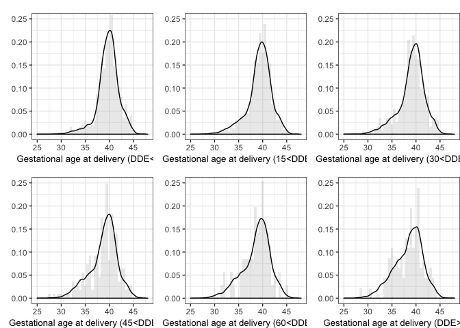
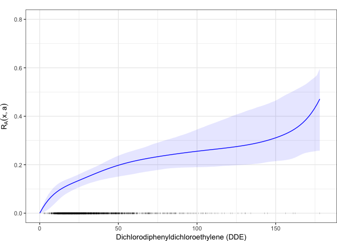
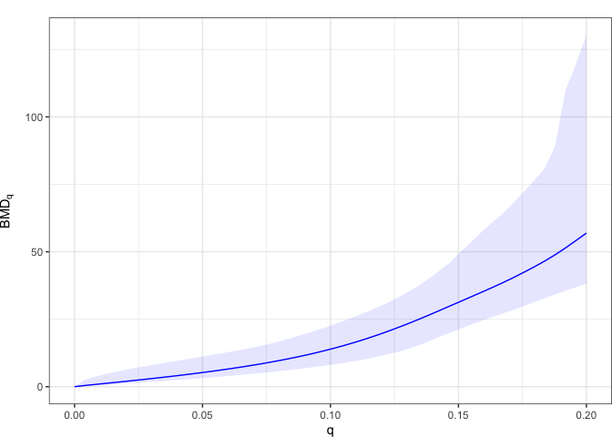

Analysis of the CPP data
================

Analysis of the US Collaborative Perinatal Project (CPP) data on the effect of Dichlorodiphenyldichloroethylene (DDE) on premature delivery [Longnecker et al., (2001)](http://www.thelancet.com/journals/lancet/article/PIIS0140673601053296/abstract) as discussed in [Canale, Durante and Dunson, (2017)](https://arxiv.org/abs/1701.02950)

Load data and packages
======================

Load the CoMiRe set of functions of the 'CoMiRe' package

``` r
library(CoMiRe)
library(splines2)
library(ggplot2)
library(gridExtra)
```

Load the CPP data

``` r
load("cpp.rda")
x = cpp$dde    # DDE 
y = cpp$gest   # gestational week at delivery
n <- NROW(cpp)
```

The DDE has a clear effect in determining premature births as can be seen from

``` r
ggplot(data=cpp) + geom_point(aes(x=dde, y=gest), alpha=.5, cex=.5) + 
  geom_smooth(aes(x=dde, y=gest), method="loess", span = 1, col=1) + 
  xlab("Dichlorodiphenyldichloroethylene (DDE)") + ylab("Gestational age at delivery") + theme_bw()
```


To have a first quantification we fit a simple logistic model to the dichotimized outcome, i.e. we classify a birth as premature if it occurs before 37 weeks.

``` r
premature <- y < 37
glmfit<- glm(premature ~ x, family="binomial")
summary(glmfit)
```

    ## 
    ## Call:
    ## glm(formula = premature ~ x, family = "binomial")
    ## 
    ## Deviance Residuals: 
    ##     Min       1Q   Median       3Q      Max  
    ## -1.2725  -0.5843  -0.5408  -0.5096   2.1111  
    ## 
    ## Coefficients:
    ##              Estimate Std. Error z value Pr(>|z|)    
    ## (Intercept) -2.160870   0.102249 -21.133  < 2e-16 ***
    ## x            0.014676   0.002468   5.946 2.75e-09 ***
    ## ---
    ## Signif. codes:  0 '***' 0.001 '**' 0.01 '*' 0.05 '.' 0.1 ' ' 1
    ## 
    ## (Dispersion parameter for binomial family taken to be 1)
    ## 
    ##     Null deviance: 2003.2  on 2311  degrees of freedom
    ## Residual deviance: 1970.0  on 2310  degrees of freedom
    ## AIC: 1974
    ## 
    ## Number of Fisher Scoring iterations: 4

CoMiRe estimation
=================

We now fit our comire model. Before doing this we fix the following prior paramters:

``` r
J <- 10 
prior <- list(mu0=mean(y), dirpar=rep(1, J)/J, kappa=1, a=2, b=2, H=10, J=J, alpha=1)
```

and the following MCMC settings

``` r
mcmc <- list(nrep=50000, nb=4000, thin=5, ndisplay=4)
```

Now we are ready to run the MCMC

``` r
fit.comire <- comire.gibbs(y, x, mcmc=mcmc, prior=prior, seed=1, max.x=180)
```

Posterior predictive check
==========================

Before assessing the performance in estimating the additional risks and benchmark doses, we check the model adequacy in terms of goodness of fit by means of posterior predictive checks. Specifically, we subdivide the observed data in bins with

``` r
break.points <- c(0, 15,30,45,60, 75, 180)
x.cpoints <- c(7.5, 22.5,37.5,52.5,67.5, 125)
groups <- as.numeric(cut(x, breaks = break.points))
xlab <- c("Gestational age at delivery (DDE<15)",
          "Gestational age at delivery (15<DDE<30)",
          "Gestational age at delivery (30<DDE<45)",
          "Gestational age at delivery (45<DDE<60)",
          "Gestational age at delivery (60<DDE<75)",
          "Gestational age at delivery (DDE>75)"
          )
```

Then using the R function `post.pred.check()` we simulate one observation from the posterior predictive distribution (fitted in `fit.comire`) of *y* ∣ *x* with *x* being the median of the covariates in each bin.

``` r
y.pred <- post.pred.check(x.cpoints, fit=fit.comire, mcmc=mcmc, J=prior$J)
y.pred <- data.frame(y.pred)
```

The posterior predictive densities are then obtained via kernel smoothing using as bandwidth parameter the mean bandwith in each bin, i.e.

``` r
bandwidths <- c(density(y.pred$X1)$bw,density(y.pred$X2)$bw,density(y.pred$X3)$bw,
                density(y.pred$X4)$bw,density(y.pred$X5)$bw,density(y.pred$X6)$bw)
bw <- mean(bandwidths)
```

and it is plotted along with the histogram of the raw data.



Marginal densities estimation
=============================

We now compute pointwise posterior mean densities for *x* in being the central value of each bin introduced before.

``` r
y.grid <- seq(min(y)-sqrt(var(y)), max(y) + sqrt(var(y)), length = 100) 
all.pdf <- list()
for(j in 1:6)
  {
  pdf_fit <- fit.cdf.mcmc(x.cpoints[j], y.grid=y.grid, fit.comire, mcmc=mcmc, H=10, max.x=180)
  data <- data.frame(pdf_fit, y.grid)
  names(data)[1:3] <- c("mean","low","upp")
 
   pdf.j <- ggplot(data) +  
    geom_line(aes(x=y.grid, y=mean), col="blue") +
    geom_ribbon(aes(ymax=upp, ymin=low, x=y.grid), fill=4,alpha=.1) + 
    coord_cartesian(xlim=c(25,48)) +  labs(x=xlab[j], y="") + 
    theme_bw() + coord_cartesian(ylim=c(0, 0.25)) +
    theme(plot.margin=unit(c(1,0,0,0),"lines"), axis.title=element_text(size=10))
  
  all.pdf[[j]] <- pdf.j
}

grid.arrange(all.pdf[[1]],all.pdf[[2]],all.pdf[[3]],all.pdf[[4]],all.pdf[[5]],all.pdf[[6]], ncol=3, nrow=2)
```


Additional risk and BMD
=======================

To obtain the additional risk function for a given threshold use the `add.risk()` function and plot it in function of `x` with `riskplot()`. In our application it is of interest to evaluate the risk of a birth accurring before 37 weekes, hence

``` r
risk.data <- add.risk(a=37, fit=fit.comire, mcmc=mcmc, xgrid=seq(0,max(x), length=100), y=y)
riskplot(risk.data$summary.risk, xlabel="Dichlorodiphenyldichloroethylene (DDE)", x=x)
```



The function `BMD()` extract estimates for the benchmark dose related to a given risk function for differente values of risk *q*.

``` r
bmd.data <- BMD(seq(0,.20, length=50), risk.data$mcmc.risk, x=seq(0,max(x), length=100))
```

A graphical representation of the BMD<sub>*q*</sub> for the different values of *q* can be obtained with

``` r
bmd.data <- BMD(seq(0,.20, length=50), risk.data$mcmc.risk, x=seq(0,max(x), length=100), alpha=0.05)
bmd.plot(bmd.data)
```



where the solid line represent the posterior mean BMD<sub>*q*</sub> and the shaded areas the related 95% credible bands. Typical values of *q* are 1%, 5%, and 10%. The next table reports both the BMD<sub>*q*</sub>, estimated via posterior mean, and the benchmark dose limit (BMDL<sub>*q*</sub>), estimated with 5% quantile of the posterior distribution of the benchmark dose.

``` r
q.values <- c(1,5,10)/100
BMDq <- BMD(q.values, risk.data$mcmc.risk, x=seq(0,max(x), length=100), alpha=.1)
knitr::kable(BMDq[c(1,2,5)], digits = 2)
```

|     q|    BMD|  BMDL|
|-----:|------:|-----:|
|  0.01|   1.02|  0.62|
|  0.05|   5.25|  3.58|
|  0.10|  13.91|  9.52|
