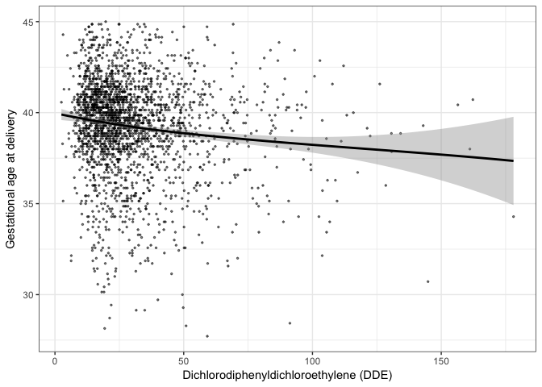
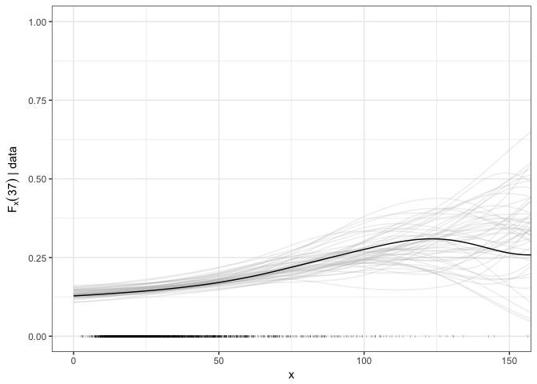
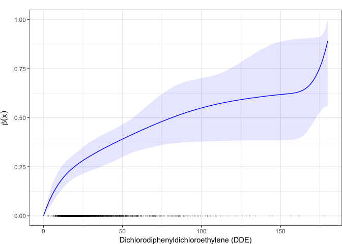
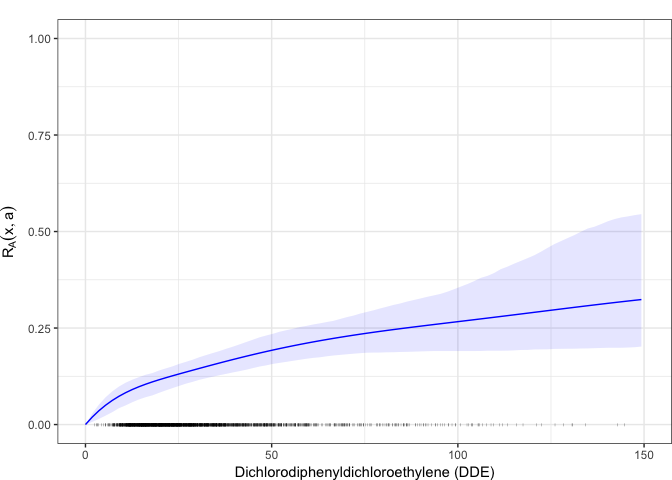
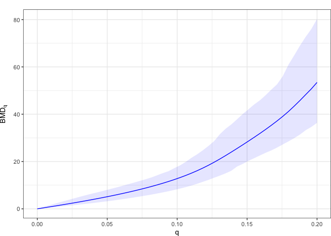

Analysis of the CPP data
================

Analysis of the US Collaborative Perinatal Project (CPP) data on the effect of Dichlorodiphenyldichloroethylene (DDE) on premature delivery [Longnecker et al., (2001)](http://www.thelancet.com/journals/lancet/article/PIIS0140673601053296/abstract) as discussed in [Canale, Durante and Dunson (2018)](https://arxiv.org/abs/1701.02950)

Load data and packages
======================

Load the CoMiRe set of functions of the 'CoMiRe' package

``` r
library(CoMiRe)
library(splines2)
library(ggplot2)
library(gridExtra)
library(KernSmooth)
```

Load the CPP data

``` r
load("cpp.rda")
x = cpp$dde    # DDE 
y = cpp$gest   # gestational week at delivery
n <- NROW(cpp)
```

The DDE has a clear effect in determining premature births as can be seen from

``` r
ggplot(data=cpp) + geom_point(aes(x=dde, y=gest), alpha=.5, cex=.5) + 
  geom_smooth(aes(x=dde, y=gest), method="loess", span = 1, col=1) + 
  xlab("Dichlorodiphenyldichloroethylene (DDE)") + ylab("Gestational age at delivery") + theme_bw()
```



To have a first quantification we fit a simple logistic model to the dichotimized outcome, i.e. we classify a birth as premature if the gestational weeks are below 37 or equal to 37.

``` r
premature <- y <= 37
glmfit<- glm(premature ~ x, family="binomial")
summary(glmfit)
```

    ## 
    ## Call:
    ## glm(formula = premature ~ x, family = "binomial")
    ## 
    ## Deviance Residuals: 
    ##     Min       1Q   Median       3Q      Max  
    ## -1.3010  -0.6013  -0.5568  -0.5243   2.0833  
    ## 
    ## Coefficients:
    ##              Estimate Std. Error z value Pr(>|z|)    
    ## (Intercept) -2.095472   0.100301 -20.892  < 2e-16 ***
    ## x            0.014674   0.002436   6.023 1.72e-09 ***
    ## ---
    ## Signif. codes:  0 '***' 0.001 '**' 0.01 '*' 0.05 '.' 0.1 ' ' 1
    ## 
    ## (Dispersion parameter for binomial family taken to be 1)
    ## 
    ##     Null deviance: 2069.4  on 2311  degrees of freedom
    ## Residual deviance: 2035.2  on 2310  degrees of freedom
    ## AIC: 2039.2
    ## 
    ## Number of Fisher Scoring iterations: 4

CoMiRe estimation
=================

To fit the CoMiRe model it is first necessary to fix the following prior parameters

``` r
J <- 10 
H <- 10
prior <- list(mu0=mean(y), dirpar=rep(1, J)/J, kappa=10, a=2, b=2, H=H, J=J, alpha=1/H)
```

and the following MCMC settings

``` r
mcmc <- list(nrep=5000, nb=2000, thin=5, ndisplay=4)
```

The Gibbs sampling algorithm is executed via

``` r
fit.comire <- comire.gibbs(y, x, mcmc=mcmc, prior=prior, seed=5, max.x=180)
```

    ## Burn in done
    ## 3250 iterations over 7000 
    ## 4500 iterations over 7000 
    ## 5750 iterations over 7000 
    ## 7000 iterations over 7000

Posterior predictive check
==========================

Before assessing the performance in estimating the additional risks and benchmark doses, we first check the model adequacy in terms of goodness of fit. This is done via posterior predictive checks.

Specifically, we use the R function `post.pred.check()` which draws smoothed empirical estimates of *F*<sub>*x*</sub>(37) from their corresponding posterior predictive distribution.

``` r
below37.comire <- post.pred.check(x, fit.comire, mcmc, H=10, a=37, max.x=180)
```

We draw 50 samples and plot them along with the smoothed estimate of *F*<sub>*x*</sub>(37) computed from the observed data.

``` r
below37.true <- locpoly(x=x, y=y<37, degree=0, bandwidth = 20, 
                        gridsize = 100, range.x = c(0, 180))$y
ppc.data <- data.frame(cbind(x=seq(0,180, length=100), 
                            Fx=c(c(below37.comire[,1:50*20])),
                            repl=c(rep(1:50,each=100))))
ppc <-    ggplot(ppc.data, aes(x=x, y=Fx)) + 
  geom_line(alpha=0.25, aes(group=factor(repl)), col="grey") +
  geom_line(data=data.frame(x=seq(0,180, length=100), y=below37.true), aes(x=x, y=y), col=1)+
  ylab(expression(F[x](37)*" | data")) + theme_bw() + 
  geom_point(data=data.frame(x, zero=rep(0,n)), aes(x, zero), alpha=1, cex=.5, pch="|") 
ppc + coord_cartesian(ylim=c(0,1), xlim=c(0,150))
```



Marginal densities estimation
=============================

We now compute the pointwise posterior mean and credible intervals of the response densities for different values of *x*. Specifically, we first divide the observed data into bins.

``` r
break.points <- c(0, 15,30,45,60, 75, 180)
x.cpoints <- c(7.5, 22.5,37.5,52.5,67.5, 125)
groups <- as.numeric(cut(x, breaks = break.points))
xlab <- c("Gestational age at delivery (DDE<15)",
          "Gestational age at delivery (15<DDE<30)",
          "Gestational age at delivery (30<DDE<45)",
          "Gestational age at delivery (45<DDE<60)",
          "Gestational age at delivery (60<DDE<75)",
          "Gestational age at delivery (DDE>75)"
          )
```

Then the pointwise posterior mean and credible intervals of the response densities for *x* in `x.cpoints` can be obtained with

``` r
y.grid <- seq(min(y)-sqrt(var(y)), max(y) + sqrt(var(y)), length = 100) 
all.pdf <- list()
for(j in 1:6)
  {
  pdf_fit <- fit.pdf.mcmc(x.cpoints[j], y.grid=y.grid, fit.comire, mcmc=mcmc, H=10, max.x=180)
  data <- data.frame(pdf_fit, y.grid)
  names(data)[1:3] <- c("mean","low","upp")
 
   pdf.j <- ggplot(data) +  
    geom_line(aes(x=y.grid, y=mean), col="blue") +
    geom_ribbon(aes(ymax=upp, ymin=low, x=y.grid), fill=4,alpha=.1) + 
    coord_cartesian(xlim=c(25,48)) +  labs(x=xlab[j], y="") + 
    theme_bw() + coord_cartesian(ylim=c(0, 0.25)) +
    theme(plot.margin=unit(c(1,0,0,0),"lines"), axis.title=element_text(size=10))
  
  all.pdf[[j]] <- pdf.j
}

grid.arrange(all.pdf[[1]],all.pdf[[2]],all.pdf[[3]],all.pdf[[4]],all.pdf[[5]],all.pdf[[6]], ncol=3, nrow=2)
```


Inference on the interpolating function
=======================================

Both adverse and non-adverse profiles are found across all the predictor space. What crucially changes with DDE is the degree *β*(*x*) of susceptibility of the women to the adverse effects of this chemical.

The posterior mean and the 95% credible bands of the *β*(*x*) can be obtained with

``` r
beta.data <- data.frame(beta=fit.comire$post.means$beta,
                        low=fit.comire$ci$beta[1,], upp=fit.comire$ci$beta[2,], 
                        dde=seq(0,180, length=100))
betaplot <- ggplot(beta.data, aes(dde,beta)) + geom_line(lty=1, col=4) + 
  geom_ribbon(aes(ymax=upp, ymin=low), fill=4,alpha=.1) +
  labs(y=expression(beta(x)), x="Dichlorodiphenyldichloroethylene (DDE)")+ theme_bw() + 
  theme(plot.margin=unit(c(1,0,0,0),"lines")) + 
  coord_cartesian(ylim=c(0,1), xlim=c(0,150))
betaplot + geom_point(data=data.frame(x, zero=rep(0,n)), aes(x, zero), alpha=1, cex=.5, pch="|") 
```



The plot highlights a notable increment in the probability of the most adverse health profile at low--dose exposures.

Additional risk and BMD
=======================

To perform quantitative risk assessment via the additional risk function, we consider the standard preterm threshold *a* = 37.

To obtain the additional risk function for a given threshold use the `add.risk()` function and plot it via `riskplot()`.

``` r
risk.data <- add.risk(a=37, fit=fit.comire, mcmc=mcmc, xgrid=seq(0,max(x), length=100), y=y)
riskplot(risk.data$summary.risk, xlabel="Dichlorodiphenyldichloroethylene (DDE)", x=x) + coord_cartesian(ylim=c(0,1), xlim=c(0,150))
```



The notable increment of the additional risk at low--dose exposures suggests conservative benchmark doses. This can be confirmed by looking at the BMD<sub>*q*</sub> expressed as a function of *q*. The latter can be obtained with the function `BMD()` which extracts estimates of the benchmark dose related to a given risk function for different values of risk *q*.

A graphical representation of the BMD<sub>*q*</sub> for the different values of *q* can be obtained with

``` r
bmd.data <- BMD(seq(0,.20, length=50), risk.data$mcmc.risk, x=seq(0,max(x), length=100), alpha=0.05)
bmd.plot(bmd.data)
```



where the solid line represents the posterior mean of the BMD<sub>*q*</sub> and the shaded areas the related 95% credible bands.

Typical values of *q* are 1%, 5%, and 10%. The next table reports both the BMD<sub>*q*</sub>, estimated via the posterior mean, and the benchmark dose limit (BMDL<sub>*q*</sub>), estimated with the lower 5% quantile of the posterior distribution of the benchmark dose.

``` r
q.values <- c(1,5,10)/100
BMDq <- BMD(q.values, risk.data$mcmc.risk, x=seq(0,180, length=100), alpha=.05)
knitr::kable(BMDq[c(1,2,5)], digits = 2)
```

|     q|    BMD|  BMDL|
|-----:|------:|-----:|
|  0.01|   1.03|  0.64|
|  0.05|   5.79|  3.70|
|  0.10|  15.29|  9.85|
